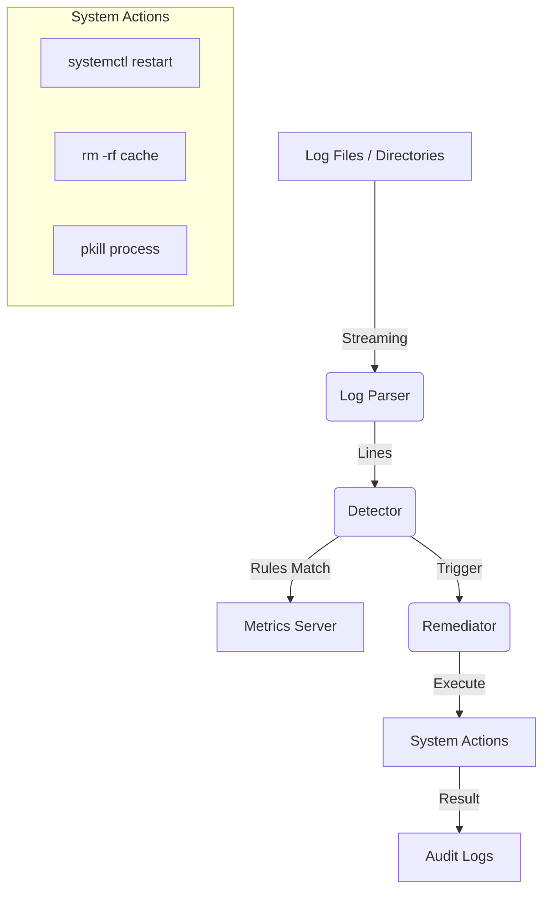

# 🛡️ Python-Based Log Analysis & Auto-Remediation Tool

[](https://opensource.org/licenses/MIT)
[](https://www.python.org/downloads/)
[](https://www.docker.com/)
[](https://kubernetes.io/)

A high-performance, production-grade SRE (Site Reliability Engineering) tool designed to monitor massive log files, detect critical failure patterns using Regex, and automatically execute remediation workflows.

---

## 🚀 Tech Stack

- **Core**: Python 3.11+ (High-performance generators for GB-scale streaming)
- **Monitoring**: [Prometheus](https://prometheus.io/) (Native instrumentation for alerting)
- **Security & Retries**: [Tenacity](https://tenacity.readthedocs.io/) (Exponential backoff for mission-critical actions)
- **UI/Terminal**: [Rich](https://github.com/Textualize/rich) (Beautiful, colored log output)
- **Containerization**: Docker (Alpine/Slim based lightweight images)
- **Orchestration**: Kubernetes (Deployment + ConfigMap driven rules)

---

## 🏗️ Architecture



---

## 💻 Setup Instructions

### 1. Local Setup (Development/PC)
Ideal for testing logic on Windows or Mac.
```bash
# Clone the repository
git clone https://github.com/your-username/log-remediator.git
cd log-remediator

# Setup virtual environment
python -m venv venv
source venv/bin/activate  # Windows: .\venv\Scripts\activate

# Install dependencies
pip install -r requirements.txt

# Run in Dry-Run mode
python src/main.py --logs logs/service.log --follow --dry-run
```

### 2. Linux Server Setup (Production)
Deployment on a bare-metal or cloud Linux instance.
```bash
# 1. Install as a service
sudo apt-get update && sudo apt-get install -y python3-pip

# 2. Setup permissions (Tool needs sudo for 'systemctl' actions)
# Edit sudoers if you want to run without manual password:
# visudo -> remediator-user ALL=(ALL) NOPASSWD: /usr/bin/systemctl

# 3. Running as a background process
nohup python3 src/main.py --logs /var/log/myapp/ --follow > remediator.log 2>&1 &
```

### 3. Docker Deployment
For containerized environments.
```bash
# 1. Build the image
docker build -t log-remediator:latest .

# 2. Run with volume mounts (to see host logs)
docker run -d \
  --name log-remediator \
  -v /var/log:/app/logs:ro \
  -p 8000:8000 \
  log-remediator:latest
```

### 4. Kubernetes (Minikube/Cloud)
For automated orchestration and scaling.
```bash
# 1. Apply the ConfigMap (Load your rules)
kubectl apply -f k8s/remediator-k8s.yaml

# 2. Setup Ingress or Service discovery for Metrics
kubectl get svc log-remediator-metrics
```

---

## ⚙️ Configuration & Usage

The tool is driven by `configs/default_rules.yaml`.

### Example Rule
```yaml
rules:
  - name: "Out of Memory"
    pattern: "OutOfMemoryError"
    severity: "CRITICAL"
    remediation:
      action: "restart_service"
      target: "my-java-app"
      retries: 3
```

### CLI Arguments
| Argument | Description | Default |
| :--- | :--- | :--- |
| `--config` | Path to YAML rules | `configs/default_rules.yaml` |
| `--logs` | Path to logs (file or directory) | Config value |
| `--follow` | Enable `tail -f` real-time mode | `False` |
| `--dry-run` | Detect but do not execute | `False` |
| `--metrics-port` | Port for Prometheus server | `8000` |

---

## 📊 Observability (Prometheus)

Once the tool is running, visit `http://localhost:8000` to see real-time metrics:
- `logs_processed_total`: Count of all lines parsed.
- `errors_detected_total`: Filterable by `rule_name` and `severity`.
- `remediations_total`: Tracking `success`, `failed`, or `dry_run`.

---

## 🤝 Contributing & License

This project is **Open Source** under the **MIT License**.

1. Fork the repo.
2. Create your feature branch (`git checkout -b feature/cool-remediation`).
3. Commit your changes (`git commit -m 'Add new remediation action'`).
4. Push to the branch (`git push origin feature/cool-remediation`).
5. Open a Pull Request.

---

*Made with ❤️ for SREs and DevOps Engineers.*
